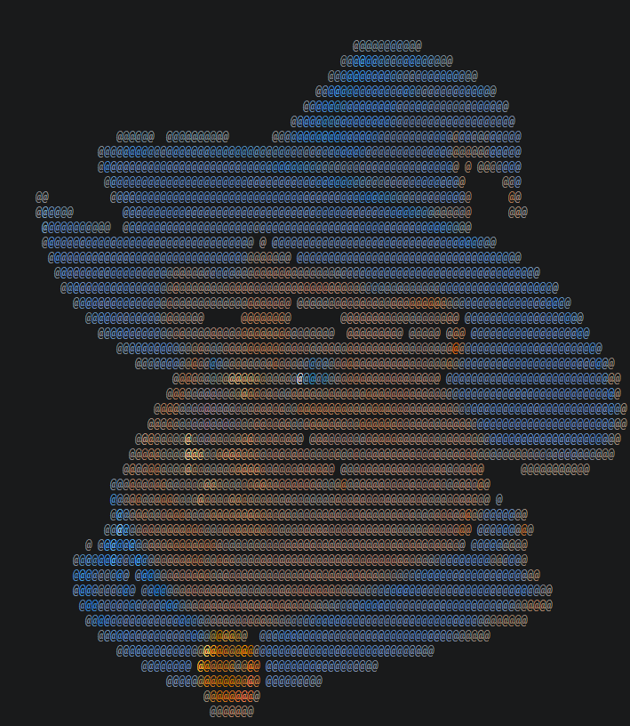
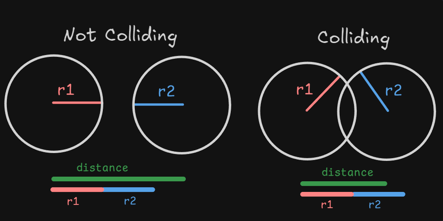
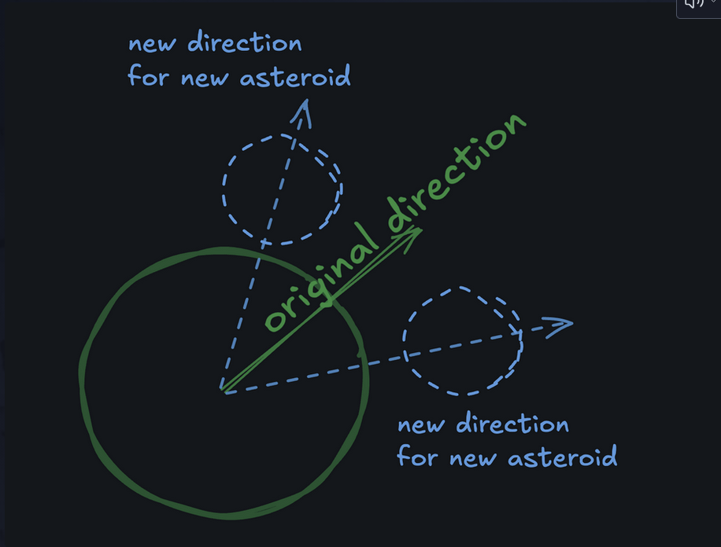

<div align="center">



# 🚀 Ashtro-destroyer

*A Pygame Asteroids clone, built from scratch — one bug, one commit, one collision at a time.*

</div>

---

## About

Ashtro-destroyer is my take on the classic Asteroids game, built in Python using Pygame as part of the Boot.dev curriculum. No shortcuts — physics, collision detection, sprite management, and shooting mechanics are all hand-built from the ground up.

This repo isn't just the final product — it's the whole process. Broken loops, wrong variable names, collisions that didn't collide, and the eventual "oh that's why" moments are baked into the commit history.

## Features

- 🛸 Player-controlled ship with rotation + thrust movement
- 💥 Real-time collision detection between asteroids, shots, and the player
- 🪨 Asteroids that split into smaller ones on impact, each flying off in a new direction
- 🔫 Shooting mechanics with cooldown-based fire rate
- ♻️ Dynamic asteroid spawning via an asteroid field system

## How collision detection works

Every object in the game (player, asteroid, shot) is a circle. Two circles are colliding if the distance between their centers is less than the sum of their radii — simple geometry, but it took a few tries to get right.

<div align="center">

</div>

## Asteroid splitting

When a shot hits an asteroid, it doesn't just disappear — it splits into two smaller asteroids, each inheriting the original direction but rotated off at an angle, so they scatter instead of overlapping.

<div align="center">

</div>

<!--
GitHub doesn't support embedding local .mp4 files pushed via git — it only renders videos
uploaded through the GitHub web editor. To add your gameplay clips:
1. Open this README.md in the GitHub web UI (click the pencil/edit icon)
2. Drag and drop your .mp4 files directly into the text box
3. GitHub will auto-generate a hosted link like:
   https://github.com/user-attachments/assets/xxxxxxxx
4. Replace the placeholder lines below with that generated markdown
-->

## Tech Stack

- **Python**
- **Pygame**
- **uv** for dependency management

## Running it locally

```bash
git clone https://github.com/akshat-bit420/Ashtro-destroyer.git
cd Ashtro-destroyer
uv sync
uv run main.py
```

---

<div align="center">
<sub>Built as part of the Boot.dev curriculum — still very much a work in progress 🛠️</sub>
</div>
